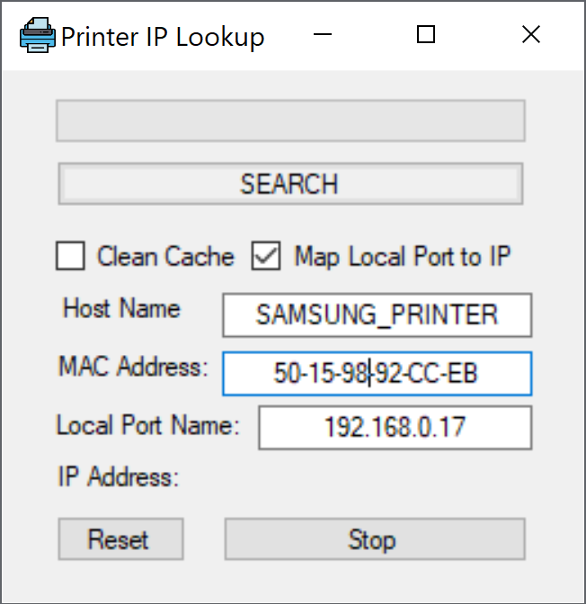
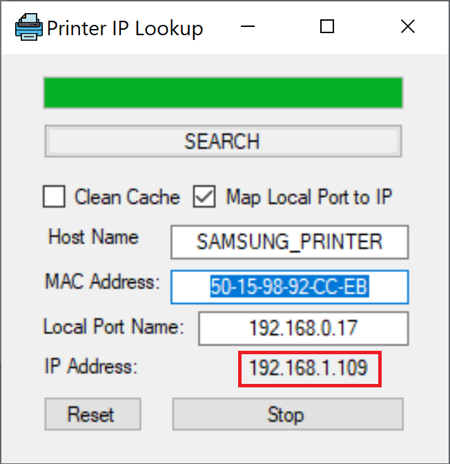

# PrinterIPLookup
Utility to find IP Address thru nslookup command based on Host Name and also thru ARP table based on its Physical (MAC) Address. C# VS2019
<H2>Description and History</H2>

This application was born as a personal project to automate the DHCP IP setting in the Printer Windows Property within Control Panel as my current Samsung Printer frequently changes its IP address rendering it as in Offline Status since the IP setting in Windows is fixed to the values it was previously set to.
Initially while developing this application the existing Internet Provider used a DHCP router; therefore, the app used Windows prompt commands like arp -a to find the MAC-IP addresses mapping to then update the Control Panel-Printer-Port setting with the newly assigned Printer IP address provided thru DHCP mode.
Although this worked it was not always stable as sometimes even the Printer will be up and connected to the Wi-Fi Network there was not mac-ip address entry in the ARP table since this table is regularly renewed and if the printer was not active its mac-ip address entry won't make it into this table, which let the introducing of Pinging of private IP address range from 192.168.0.0 to 192.168.0.255 in order to wake up the Printer connection and achieve its respective entry into the ARP table.

About three months later after developing this application, a change on the ISP from DHCP to PPPoE caused this application to be unable to find the IP address map to the MAC address most of the time as the ARP table is no updated even after pinging the correct IP address of the Printer since PPPoE does not rely on ARP table as DHCP does.
In order to solve this, I introduced a field to include the Host Name so that the primary search will be done thru nslookup command with the Host Name "SAMSUNG_PRINTER" as a parameter. In case that search failed on finding the corresponding the IP address, the DHCP search will run next.
In that way this app is suitable to work in both types of Networks PPPoE and DHCP.

Finally, after the IP Address has been found, the Windows-Printer-Property object is retrieved and updated thru WINAPI and .NET framework.

This application uses sound to indicate the status of the execution of the application like IP Address found and updated in the Windows Printer Property or Search has been stopped or it has finished along with a progress bar for visual feedback.

This application can also be used to only find the mapping IP address from a Host Name or Mac address by unchecking the box: "Map Local Port to IP".
This action will prevent to update the Windows-Printer-Property-IP field within Control Panel.

In most of the cases, it is desired to run the application to connect the Computer to the Printer, so the application will autorun the Search when it's launched.
As the Printer Host Name is fixed and the MAC address too, these two values have been hardcoded so there is no need to the user to input them.
Still these text boxes are editable in case want to run this functionality on other devices.
The Reset button will refresh the text boxes with the hardcoded values.

Additionally, I wanted to explore the inclusion of a Splash Screen which was realized thru the Magnetic Solution screen which will display for 4.5 seconds.

<strong>Note:</strong> Not intended any copyright infringement in case there is a company registered under that name anywhere in the world.

 

 

